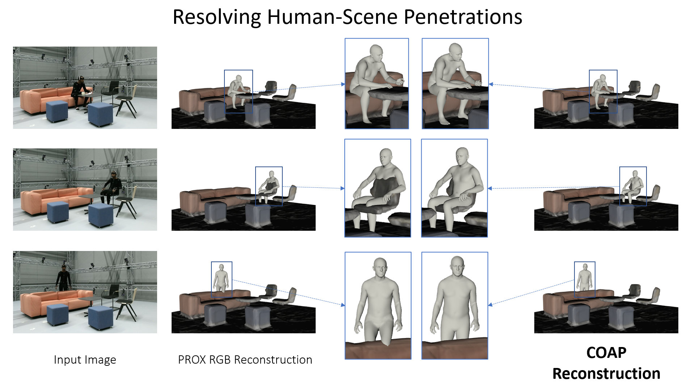

# Tutorials

We provide example scripts to use COAP inside of optimization loops to resolve collisions with environments and self-intersections. 

### **Collisions with Environment**:
Execute the following script to load a scene (scene mesh and a SMPL body) and optimize the placement of the human body such that collisions are resolved:
```bash

python scene_collisions.py --sample_body './samples/scene_collision/sample_bodies/frame_01743.pkl' --bm_dir_path ${MODELS} --model_type smplx --gender neutral --scan_path './samples/scene_collision/raw_kinect_scan/scan.obj'

python scene_collisions.py --sample_body './samples/scene_collision/sample_bodies/frame_01486.pkl' --bm_dir_path ${MODELS} --model_type smplx --gender neutral --scan_path './samples/scene_collision/raw_kinect_scan/scan.obj'
```
where `${MODELS}` is a directory path with the SMPL bodies of the following structure (for more details see https://github.com/vchoutas/smplx#model-loading):
```bash
${MODELS}
├── smpl
│   ├── SMPL_FEMALE.pkl
│   └── SMPL_MALE.pkl
│   └── SMPL_NEUTRAL.pkl
├── smplh
│   ├── SMPLH_FEMALE.pkl
│   └── SMPLH_MALE.pkl
└── smplx
    ├── SMPLX_FEMALE.npz
    ├── SMPLX_FEMALE.pkl
    ├── SMPLX_MALE.npz
    ├── SMPLX_MALE.pkl
    ├── SMPLX_NEUTRAL.npz
    └── SMPLX_NEUTRAL.pkl
```


### **Self-intersections**:
Execute the following example script to untangle a self-intersecting SMPL body: 
```bash
python untangle_body.py --bm_dir_path ${MODELS} --model_type smplx --gender neutral --sample_body ./samples/selfpen_examples/001.pkl
```

